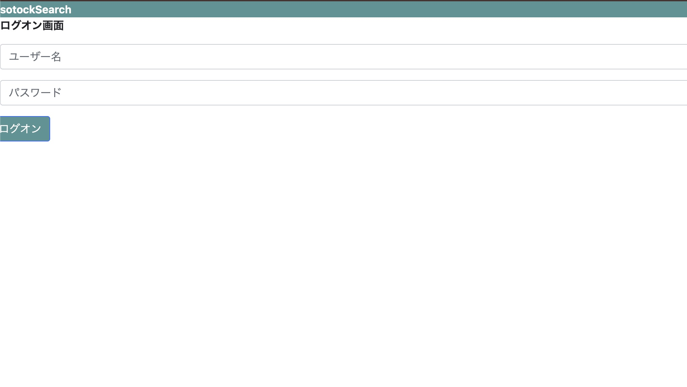
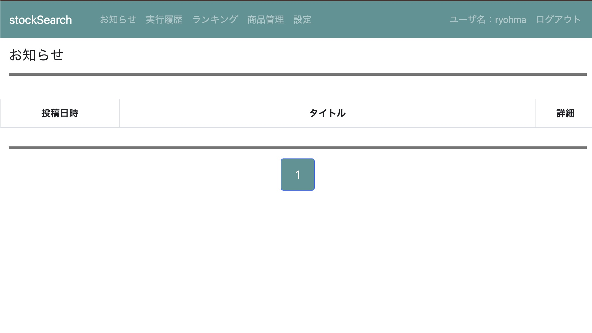
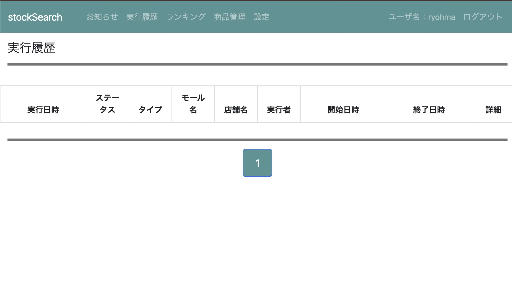
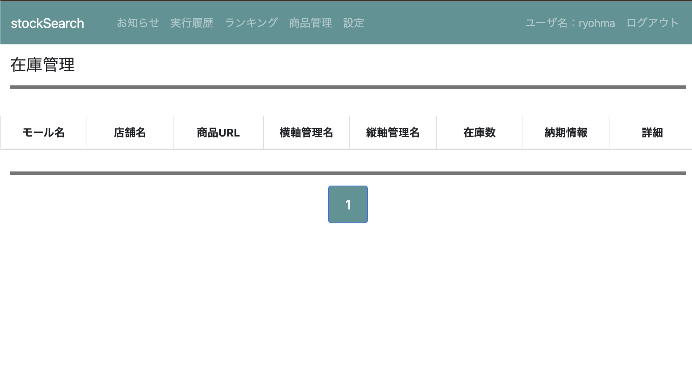
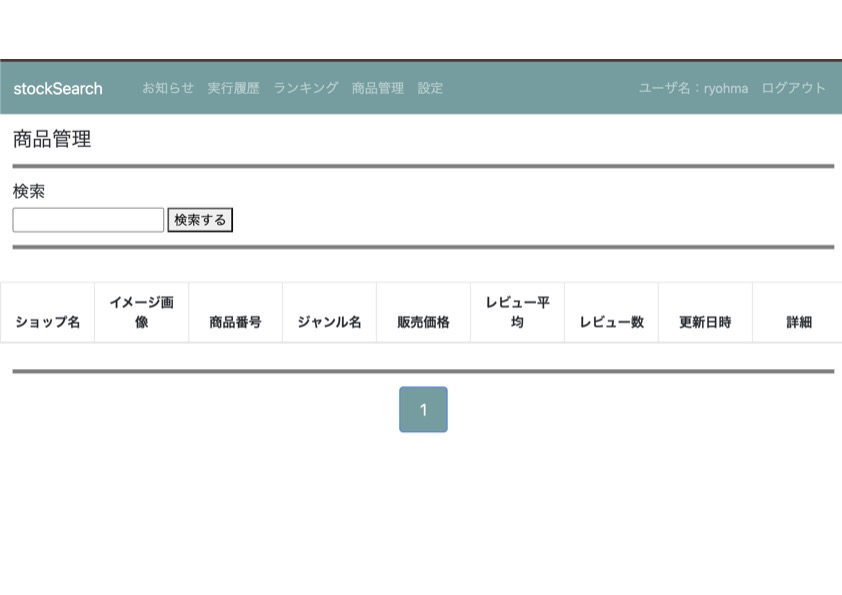

## Python Django Stock Search

Djangoで構築された在庫監視・商品トラッキングWebアプリケーションです。  
楽天市場APIと連携して商品在庫を取得し、定期的に状態を監視します。  
また、アーキテクチャは **他ECモールAPIにも拡張しやすい汎用設計**となっています。

---

## ✨ 主な機能
- 楽天市場APIとの連携による在庫情報の取得
- 在庫変動を定期的にチェック（Cron / Scheduler 対応）
- 商品ごとのトラッキング管理
- 管理者向けダッシュボード（Django Admin）
- モールAPIの切り替えが簡単な設計（Amazon/Shopifyなどに対応可能）

---

## 📷 スクリーンショット　プレビュー

| 画面 | プレビュー |
|------|------------|
| ログイン画面 |  |
| システムお知らせ画面 |  |
| Job実行履歴画面 |  |
| 商品在庫監視画面 |  |
| システム設定画面 |  |

---

## 🛠 使用技術
- Python 3.9.6
- Django 4.2.25
- MySQL / MariaDB
- REST API（楽天市場商品検索API）

---

## 🚀 セットアップ

### 1️⃣ 仮想環境の作成 & 有効化
```bash
python3 -m venv venv
source venv/bin/activate  # Windows の場合: venv\Scripts\activate
```

### 2️⃣ ライブラリインストール
```bash
pip install -r requirements.txt
```

### 3️⃣ DBマイグレーション
```bash
python manage.py migrate
```

### 4️⃣ スーパーユーザー作成
```bash
python manage.py createsuperuser
```

### 5️⃣ ローカル起動
```bash
python manage.py runserver
```

---

## 環境変数の設定

1. `.env.example` をコピーして `.env` を作成します。
```bash
cp .env.example .env
```

2. .env を開いて、自分の環境に合わせて設定を変更します。
```bash
# 例: MySQL
DB_NAME=django_stockSearch
DB_USER=root
DB_PASSWORD=your_mysql_password
DB_HOST=
DB_PORT=
UNIX_SOCKET=/tmp/mysql.sock

# Django
SECRET_KEY=your_secret_key
DEBUG=True

# Rakuten API
RAKUTEN_APPLICATION_ID=your_rakuten_app_id
RAKUTEN_AFFILIATE_ID=your_rakuten_affiliate_id
```

3. Django からは environ ライブラリを使って .env の値を読み込まれます。

```python
# /src/app_config/settings.py
import environ
env = environ.Env()
environ.Env.read_env()

SECRET_KEY = env('SECRET_KEY')
DEBUG = env.bool('DEBUG', default=False)

DATABASES = {
    'default': {
        'ENGINE': env('DB_ENGINE'),
        'NAME': env('DB_NAME'),
        'USER': env('DB_USER'),
        'PASSWORD': env('DB_PASSWORD'),
        'HOST': env('DB_HOST'),
        'PORT': env('DB_PORT'),
        'OPTIONS': {'unix_socket': env('UNIX_SOCKET')},
    }
}
```

> 注意: .env は .gitignore に追加して、絶対に GitHub に公開しないでください。

---

## 🔐 楽天市場APIの設定

以下の環境変数（または .env ファイル）を設定してください
```bash
RAKUTEN_APPLICATION_ID=<Your_Rakuten_App_ID>
RAKUTEN_AFFILIATE_ID=<Optional>
```

楽天APIの詳細：[https://webservice.rakuten.co.jp/](https://webservice.rakuten.co.jp/)

---

## ✅ 将来拡張例
- Shopify
- Amazon
- Yahooショッピング
- SHOPLIST
- ZOZOTOWN
- Qoo10
など

---


## 🧑‍💻 作者

**Ryohma U.**  
ポートフォリオ：[https://www.rnsystem.jp](https://www.rnsystem.jp)

---

> 💡 **補足**  
> 本システムの利用には各ECモールAPIの使用ルール遵守が必要です。
> また、商用利用の場合は利用者側で適切なセキュリティ対策をご検討ください。
